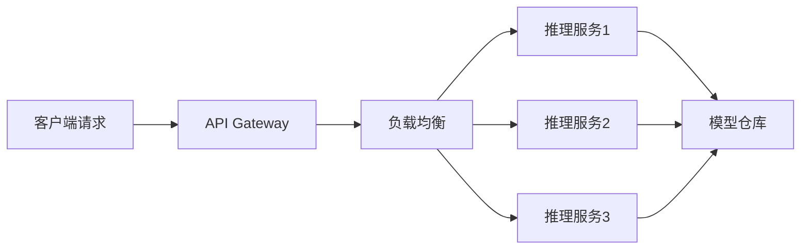

# TensorFlow模型部署指南

## 概述

在AI工程化实践中，模型部署是一个关键环节。本文将分享如何搭建一个高性能的模型推理服务。

## 技术架构



## 模型量化

```python
import tensorflow as tf

def quantize_model(model_path: str, output_path: str):
    """模型量化 - 减少模型体积和推理延迟"""
    converter = tf.lite.TFLiteConverter.from_saved_model(model_path)

    # INT8量化
    converter.optimizations = [tf.lite.Optimize.DEFAULT]
    converter.representative_dataset = representative_data_gen
    converter.target_spec.supported_types = [tf.int8]

    tflite_model = converter.convert()

    with open(output_path, 'wb') as f:
        f.write(tflite_model)

    print(f"模型量化完成: {model_path} -> {output_path}")
```

## FastAPI推理服务

```python
from fastapi import FastAPI
from pydantic import BaseModel
import tensorflow as tf
import numpy as np

app = FastAPI(title="AI推理服务")

class PredictRequest(BaseModel):
    data: list[float]
    model_version: str = "v1"

class PredictResponse(BaseModel):
    prediction: list[float]
    latency_ms: float
    model_version: str

@app.post("/predict", response_model=PredictResponse)
async def predict(request: PredictRequest):
    # 模型推理逻辑
    pass
```

## Docker化部署

```dockerfile
FROM tensorflow/serving:latest

COPY models /models
COPY config/model_config.conf /models/

ENV MODEL_NAME=my_model

EXPOSE 8501

CMD ["tensorflow_model_server", \
     "--port=8501", \
     "--model_config_file=/models/model_config.conf"]
```

## 性能指标

- 推理延迟: < 50ms (P99)
- 吞吐量: 1000 QPS (单节点)
- 模型体积: 减少 75% (量化后)
- 部署时间: < 5min (自动CI/CD)
